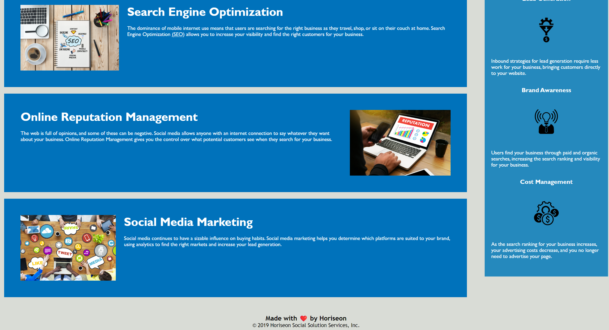

# Horiseon website with accessibility improvements

## Description

Horiseon is a marketing agency that has requested a refactor of their website's codebase so that it follows accessibility standards and is optimised for search engines.

This is important because:

- It ensures that people with disabilities can access a website using assistive technologies such as video captions, screen readers, and braille keyboards. 
- Accessibility boosts search engine optimisation. Accessible sites are better positioned in search engines like Google.
- Mitigates against potential future litigation in the event that people with disabilities cannot access the website.

## Table of Contents

- [Installation](#installation)
- [Usage](#usage)
- [Credits](#credits)
- [License](#license)

## Installation

No installation steps required, this is a static HTML page

## Usage

URL: https://drrobotnik7.github.io/horiseon-accessibility/

Click in the links in the navigation bar to smoothly scroll to the relevant section of the website

## Credits

The Sibert-pod-11 gang! It's been a pleasure collaborating with you on our first project and looking forwards to tackling the rest!

## License

No license chosen